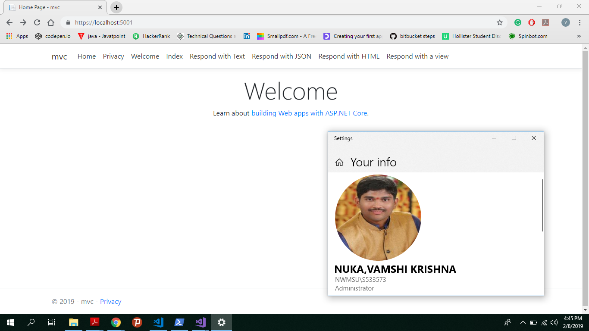

## Assignment2

#P2: MVC
- My app demonstrates MVC functionlaity.\

#How to run my program
- To run program user need to open the powershell as admininstrator first.
- Set the folder path.
- Now type the dotnet run command and follow the instructions.
- Happy coding.